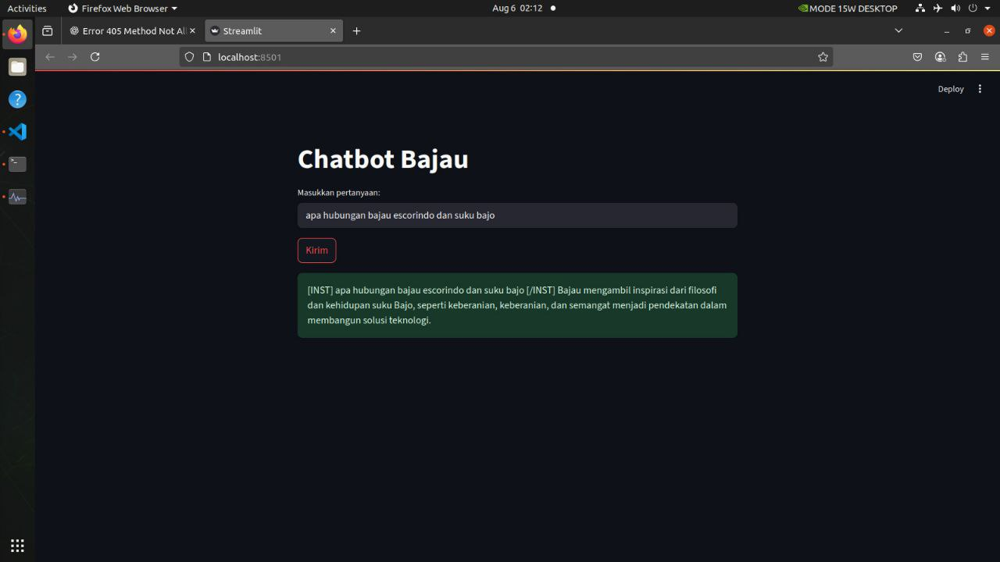

# Chatbot informasi mengenai PT Bajau Escorindp dengan Unsloth Mistral-7B Instruct (4-bit)

## Deskripsi Proyek

Proyek ini menggunakan model LLM open-source `unsloth/mistral-7b-instruct-v0.2-bnb-4bit` untuk menghasilkan **instruksi yang terstruktur dan berorientasi tugas** berdasarkan prompt dalam bahasa alami (natural language). Tujuan utamanya adalah memberikan informasi mengenai perusahaan PT Bajau Escorindo.

---

## 1. lasan Memilih Model `unsloth/mistral-7b-instruct-v0.2-bnb-4bit`

Setelah mencoba berbagai model open-source dari Hugging Face dan Unsloth, saya memilih model ini karena alasan berikut:

### 🔹 1. **Ringan & Hemat Memori (4-bit Quantization)**
Model ini telah dikompresi menggunakan teknik quantization 4-bit dari `bitsandbytes`, sehingga jauh lebih ringan dan bisa dijalankan di perangkat dengan sumber daya terbatas tanpa GPU.

### 🔹 2. **Sudah Fine-tuned untuk Instruksi**
Model ini adalah versi `Instruct` dari Mistral-7B, yang berarti telah dilatih khusus untuk **mengikuti perintah dan memberikan jawaban berbasis tugas secara terstruktur dan relevan** atau bisa dikatakan model khusus **Chatbot**.

### 🔹 3. **Kompatibel dengan Library Unsloth**
Model ini didesain untuk berjalan optimal dengan framework [Unsloth](https://github.com/unslothai/unsloth), yang memungkinkan proses inferensi dan fine-tuning berjalan lebih efisien di perangkat lokal.

### 🔹 4. **Satu-satunya Model yang Kompatibel dengan Perangkat Saya**
Dari semua model yang saya uji, hanya model ini yang dapat berjalan **tanpa error dan tanpa masalah kompatibilitas** pada perangkat saya. Ini membuatnya menjadi pilihan paling praktis dan stabil.

---

## 2. Perancangan dan Persiapan Dataset

### Jenis Data

Dataset disusun dalam format `.jsonl` berisi:
- `instruction`: prompt atau pertanyaan dari pengguna
- `input`: informasi tambahan (bisa kosong)
- `output`: jawaban atau instruksi

#### Contoh Data:
```json
{"instruction": "Apa inspirasi utama dari filosofi Bajau?", "input": "", "output": "Inspirasi utama datang dari cara hidup Suku Bajo yang menyatu dengan laut, simbol harmoni, keberanian, dan adaptasi."}
```

### Proses Prepocessing

- **Tokenisasi & Max Sequence Length**
Tokenisasi dan pengaturan panjang kalimat dilakukan menggunakan FastLanguageModel dari library Unsloth dengan inisialisasi otomatis dari bawaan model Mistral-7B Instruct (4-bit)

- **Standarisasi Format Teks**
Perubahan format chat dari format instruction,input,output menjadi system,user,assistant pada seluruh chat

### Proses Penanganan Masalah & Edge Cases

- **Pembersihan data kosong**
Proses menampilkan data Json dan pembersihan data kosong menggunakan library pandas

- **Parafrase Data**
Proses parafrase data dilakukan secara manual tujuannya memperbanyak variasi data dan mempertajam pengetahuan

---

## 3. Strategi Fine-Tuning

### Tuning dengan LoRA 
Model ini menggunakan Metode PEFT dari Unsloth dengan function FastLanguageModel.get_peft_model pada function ini parameter yang diatur adalah r,target_modules,lora_alpha,lora_dropout,random_state
- pengaturan r, pada model ini jumlah r yang ditetapkan adalah 16 tujuannya agar model bisa belajar data baru lebih kompleks
- pada target_modeules semua lapisan yang ada pada self_attention di pilih dalam proses pelatihan model baru tujuannya agar model baru dapat fleksibel dan lebih dapat beradaptasi
- lora-alpha = 16 merupakan skala yang dipilih agar dapat mengontrol kontribusi lora agar tidak terlalu dominan
- lora_dropout mencegah overfitting terjadi saat pembuatan model
- random_state di pakai agar model memilih data train secara acak 

### Pengaturan Hyperparameter
Pada pembuatan model ini pengaturan Hyperparameter menggunakan SFFTrainer dari trl dan TrainingArguments dari Transformer teknik pengaturan parameter yang dipakai ada beragam cara mulai dari max_steps,batch_size,seed,learning_rate,logging_steps,optimize dan simpan hasil training dengan output_dir
#### pada SFFTrainer persiapan training data diatur dalam beberapa cara:
  - Tokenisasi yang berfungsi untuk mengatur teknik Tokenisasi yang dipakai dalam training data
  - Jenis data yang akan di training
  - Pengaturan Model yang akan di tuning
    
#### pada TrainingArguments proses pengaturan hyperparameter dalam pembuatan model ada beberapa teknik: 
  - max_step yang berfungsi sebagai pengatur jumlah proses training data dilakukan
  - per_device_train_batch_size=2 yang berarti teknik training dilakukan dengan dua data secara terus menerus sampai akhir dataset
  - learning_rate = 2e-4 dipilih untuk mengatur tempo training
  - optimisasi yang dipakai ialah adamw_8bit cocok untuk model besar dan hemat memori
  - weight_decay untuk mencegah kemungkinan overfitting
  - logging_steps = 1 digunakan untuk menampilkan informasi loss setiap 1 langkah
  - output_dir merupakan fungsi untuk menyimpan hasil training 

## Tantangan Potensial
  - Overfitting = ketika menggunakan teknik pembelajaran yang lebih dalam dan kompleks namun dataset yang tersedia hanya 900 dapat menyebabkan model menghafal dan tidak dapat melakukan prediksi kata misalnya ketika max_step yang tinggi, learning_rate yang terlalu cepat dan jumlah r pada LoRA yang besar, cara mengatasinya dengan mengatur sesuai dataset yang kecil dan penambahan function droput pada teknik LoRA misalnya
  - Underfitting = Ketika model lambat belajar ini merupakan kebalikan dari overfitting faktor terbesar terjadinya Underfitting adalah dataset yang kecil dan kotor selain itu pengaturan parameter juga dapat mempengaruhi underfitting ini
  - Resource yang kurang mumpuni, Karna resource yang kurang model yang dipilih untuk dituning merupakan model yang telah di tuning lalu di tuning kembali dengan dataset yang baru, mistral-7b-instruct(4bit) merupakan model yang dipilih setelah pengujian banyak model misalnya TiniLlama,Qwen,Gemma, dan Llama-3.2 diantara model yang diuji mistral-7b-instruct(4bit) yang paling relefan dengan resource yang tersedia
  - Halusinasi atau jawaban chatbot yang ngaur, karena dataset yang kurang yaitu 900 data saja sehingga pemilihan model sangat berpengaruh hal ini karna parameter setiap model itu berbeda beda, Llama3.2 memiliki hasil yang paling bagus namun prosesnya yang sangat lama membuat model ini susah berjalan di resource yang ada, kurangnya data yang tersedia sehingga model yang memiliki parameter dibawah 3B misalnya phi-2,Qwen-1.8B, TinyLlama, Gemma memberikan output yang sangat buruk(ngawur). Sehingga Mistral-7B-instruct(4bit) menjadi pilihan yang baik dengan resource yang tersedia hasilnya tingkat halusinasi sangat kecil dan dapat menjawab pertanyaan walaupun kadang jawabannya kurang tepat namun dari semua model yang diuji model inilah yang memberikan jawaban yang paling baik


## 4. Teknik Evaluasi

### Logging Step
- Training loss yang ditampilkan pada saat training dapat memberikan informasi bagaimana model dapat memahami dataset yang ada semakin rendah training loss maka semakin besar informasi mengenai proses training yang baik, pada model ini training loss ada di angka 1.175700 di step ke 60

### Manual Cek
- Selain dari training loss model ini juga di cek secara manual dengan cara mengetest ketepatan jawaban dan dari hasil test manual chatbot dapat menjawab dengan baik namun untuk ketepatan tanggal dan ketepatan nama, akurasinya kurang tepat misalnya kadang penebakan tanggal akan melenceng 1 atau 2 tanggal misalnya ketika penebakan nama kadang nama depan tepat namun nama akhirnya salah

### Perbandingan Model
Dari banyak model yang diuji ada beragam macam hasil
Qwen-1.8B (1.8 Miliar) - Hasil Finetuningnya kurang kadang bercampur bahasa mandarin
Gemma 2B (2 Miliar)    - Hasil Finetuningnya mengalami halusinasi dan jawaban yang berulang
TinyLlama (1.1 Miliar) - Hasil Finetuningnya mengalami halusinasi yang sangat parah
Phi-2 (2.7 Miliar)     - Hasil Finetuningnya berbahasa inggris, kurang memahami bahasa indonesia


## 5. Workflow dan Hasil

### Workflow
Unsloth merupakan library yang mendukung optimasi FineTuning dengan berbagai macam model pada pembuatan model ini adapun workflownya
unsloth(FastLanguageModel) >  unsloth(get_peft_model) > datasets(load_dataset) > SFFTrainer > TrainingArguments > train > test

## Hasil
prompt = apa hubungan bajau escorindo dan suku bajo
hasil  = Bajau mengambil inspirasi dari filosofi dan kehidupan suku Bajo, seperti keberanian, dan semangat menjadi pendekatan dalam membangun solusi teknologi.

